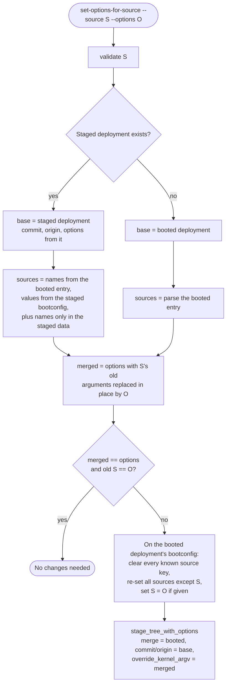
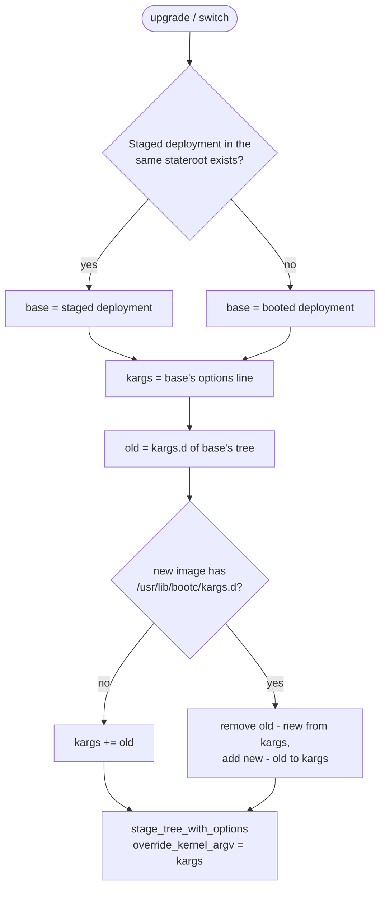

# Kernel arguments

The default bootc model uses ["type 1" bootloader config](https://uapi-group.org/specifications/specs/boot_loader_specification/)
files stored in `/boot/loader/entries`, which define arguments
provided to the Linux kernel. 

The set of kernel
arguments can be machine-specific state, but can also
be managed via container updates.

The bootloader entries are currently written by the OSTree backend.

More on Linux kernel arguments: <https://docs.kernel.org/admin-guide/kernel-parameters.html>

## /usr/lib/bootc/kargs.d

Many bootc use cases will use generic "OS/distribution" kernels.
In order to support injecting kernel arguments, bootc supports
a small custom config file format in `/usr/lib/bootc/kargs.d` in
TOML format, that have the following form:

```
# /usr/lib/bootc/kargs.d/10-example.toml
kargs = ["mitigations=auto,nosmt"]
```

There is also support for making these kernel arguments
architecture specific via the `match-architectures` key:

```
# /usr/lib/bootc/kargs.d/00-console.toml
kargs = ["console=ttyS0,115200n8"]
match-architectures = ["x86_64"]
```

NOTE: The architecture matching here accepts values defined
by the [Rust standard library](https://doc.rust-lang.org/std/env/consts/constant.ARCH.html)
(using the architecture of the `bootc` binary itself).

In some cases for Linux, this matches the value of `uname -m`, but
definitely not all. For example, on Fedora derivatives there is `ppc64le`,
but in Rust only `powerpc64`. A common discrepancy is that
Debian derivatives use `amd64`, whereas Rust (and Fedora derivatives)
use `x86_64`.

### Changing kernel arguments post-install via kargs.d

Changes to `kargs.d` files included in a container build
are honored post-install; the difference between the set of
kernel arguments is applied to the current bootloader
configuration. This will preserve any machine-local
kernel arguments.

## Kernel arguments injected at installation time

The `bootc install` flow supports a `--karg` to provide
install-time kernel arguments. These become machine-local
state. 

Higher level install tools (ideally at least using `bootc install to-filesystem`
can inject kernel arguments this way) too; for example,
the [Anaconda installer](https://github.com/rhinstaller/anaconda)
has a `bootloader` verb which ultimately uses an API
similar to this.

Post-install, it is supported for any tool to edit
the `/boot/loader/entries` files, which are in a standardized
format. 

Typically, `/boot` is mounted read-only to limit
the set of tools which write to this filesystem. It is not
"physically" read-only by default. One approach to edit
them is to run a tool under a new mount namespace, e.g.

```bash
unshare -m
mount -o remount,rw /boot
# tool to edit /boot/loader/entries
```

`bootc loader-entries set-options-for-source` manages per-machine
kernel arguments on behalf of a named *source*; see
[Source-tracked kernel arguments](#source-tracked-kernel-arguments) below.

Other projects such as `rpm-ostree` do too, via e.g. `rpm-ostree kargs`,
which is just a frontend for editing the bootloader configuration
files. Note an important detail is that `rpm-ostree kargs` always
creates a new deployment.

`rpm-ostree kargs` and bootc interoperate as they both use the ostree
backend today: any kernel arguments changed via either mechanism persist
across upgrades, and each builds on the deployment it replaces, so a
change staged by one is not lost when the other stages next.

It is currently undefined behavior to remove kernel arguments
locally that are included in the base image via
`/usr/lib/bootc/kargs.d`.

## Source-tracked kernel arguments

A tool that adds kernel arguments — TuneD applying a profile is the
motivating case — needs to later replace or remove exactly the arguments
it added, without keeping state in `/etc` (which may be transient).
`bootc loader-entries set-options-for-source` records ownership next to
the arguments themselves, in the BLS entry:

```
options root=UUID=... rw ostree=/ostree/boot.0/... console=ttyS0 nohz=full isolcpus=1-3 rd.driver.pre=vfio-pci
x-options-source-tuned nohz=full isolcpus=1-3
x-options-source-dracut rd.driver.pre=vfio-pci
```

* `options` is the kernel command line and the ground truth.
* `x-options-source-NAME` is bookkeeping: the arguments source `NAME`
  currently owns. Bootloaders ignore unknown keys. Names are limited to
  `[A-Za-z0-9_-]+`.
* A source key with an **empty value is a tombstone** ("this source owns
  nothing"). bootc never deletes a key, it clears it.

```bash
# set or replace TuneD's arguments
bootc loader-entries set-options-for-source --source tuned --options "nohz=full isolcpus=1-3"
# remove them
bootc loader-entries set-options-for-source --source tuned
```

Both stage a new deployment (unless nothing would change); the arguments
take effect on the next boot. See
`man bootc-loader-entries-set-options-for-source`.

### How a call is processed



* **Base vs. merge deployment.** The commit, origin and current
  `options` come from the *staged* deployment when one exists, so a
  pending `bootc upgrade` is kept. The merge deployment (for the `/etc`
  merge, and where the source keys are written) is always the booted one.
* **In-place replacement.** The source's arguments are replaced where
  they were, so re-applying an unchanged source is byte-identical and
  a no-op even when other arguments follow, and the relative order of
  arguments is preserved (it matters where the last occurrence wins).
* **The full set is written on every call**, tombstones included. This
  is what lets ostree carry the keys correctly through staging.

### How the keys survive staging

A staged deployment has no BLS entry until finalization at shutdown, and
any later staging in the same boot — `bootc upgrade`, `rpm-ostree kargs`,
another `set-options-for-source` — replaces it. ostree carries the
`x-options-source-*` keys across that gap in the staged deployment data
(`bootconfig-extra`) and decides which set to carry when a staging is
replaced; that mechanism, and the contract bootc follows as an "aware"
caller, are documented in
[Extension BLS keys and staged deployments](https://ostreedev.github.io/ostree/bootconfig-extra/)
on the ostree side. It requires ostree 2026.1 (2026.5 for the case where
another tool re-stages in the same boot); bootc checks the version at
runtime.

On composefs-backed systems bootc writes the BLS entries itself, and
`set-options-for-source` keeps the same model without ostree: it stages
the booted deployment again with a new entry carrying the merged
`options` line, and the current entry becomes the rollback, so
`bootc rollback` undoes the change just as it does for a new
deployment. Finalization installs the pending entries at shutdown; there
is no new state directory since the deployment is the same. If an upgrade
is already staged, its pending entry is rewritten instead and the change
rides along with it (and is dropped with it). A removed source's key is
deleted rather than tombstoned. UKI boot is not supported, since the
arguments are embedded in the image.

### Interaction with `bootc upgrade` / `switch`



Upgrading builds on the staged deployment's arguments when there is one,
so a source change (or an `rpm-ostree kargs` change) staged earlier in
the same boot survives the upgrade; only the `kargs.d` *diff* between the
two images is applied on top. The upgrade path never touches source keys;
ostree carries them forward, and on composefs bootc copies the extension
keys of the entry it builds on into the new one along with `options`.

### Interaction with `rpm-ostree` and direct edits

`rpm-ostree kargs` likewise builds on the pending deployment, so the two
can be interleaved in either order. It does not know about source keys;
ostree carries them. If something edits `options` directly (for example
`rpm-ostree kargs --delete` of an argument a source owns), the source's
record is stale until that source is next written — a subsequent
`set-options-for-source` for it simply finds nothing to remove.

### Consumers

TuneD (2.27+ with the bootc bootloader support) uses `--source tuned`,
declaring its profile's full argument set on every apply and clearing it
on unapply. On images with a transient `/etc`, set TuneD's
`profile_mode` to `manual` in the image so it does not auto-select a
different profile on each boot and clear the administrator's arguments.

## Injecting default arguments into custom kernels

The Linux kernel supports building in arguments into the kernel
binary, at the time of this writing via the `config CMDLINE`
build option. If you are building a custom kernel, then
it often makes sense to use this instead of `/usr/lib/bootc/kargs.d`
for example.
